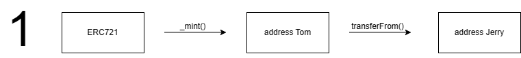
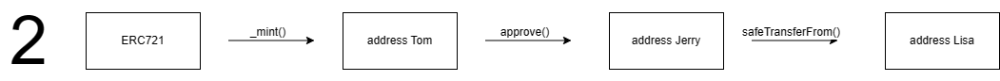
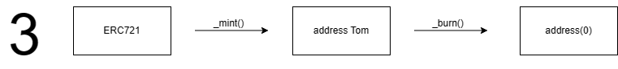

# ERC721

## 总览

ERC721是**非同质化代币**(Non-Fungible Token)标准，与ERC20不同，每一枚代币都有单独的编号。

ERC721标准的提出人是William Entriken、Dieter Shirley、Jacob Evans和Nastassia Sachs，他们在2018年1月23日提交了EIP-721的草案。

### ERC165

因为ERC721继承了ERC165，所以稍微讲一下ERC165。

ERC165的作用是让合约声明自己支持那些接口。例如，可以通过ERC165来判断合约是否支持接受ERC721代币

## 实现

> https://eips.ethereum.org/EIPS/eip-721

以上是ERC721的标准，相对于ERC20复杂了许多。除了标准的ERC721标准外，还有ERC721 Metadata、ERC721Enumerable和IERC721Receiver。

* IERC721：这是核心接口，包含了代币的所有权、转移、授权等基本功能。
- IERC721Metadata：这是可选接口，添加了代币的名称、符号和URI等元数据。
- IERC721Enumerable：这是可选接口，允许在链上枚举代币，例如获取总数、按索引查询等。
- IERC721Receiver：当合约想要安全接收721代币时，必须实现这个接口。

我们以IERC721为核心实现自己非同质化代币合约，添加了名称和符号。

[实现案例](../ERC721/MyERC721.sol)

### 变量

* `_name` NFT名称

* `_symbol` NFT符号

* `mapping(uint256 => address) private _ownerOf` tokenId => 拥有该token的地址，存储每个tokenid对应的拥有者地址

* `mapping(address => uint256) private _balanceOf`  查询地址 => 拥有该token的数量。

* `mapping(uint256 => address) private _approvals` tokenId => 被授权地址

* `mapping(address => mapping(address => bool)) _operatorApprovals` 被授权地址 => 授权地址 => 是否授权。记录每个地址授权给其他地址的是否可操作

### 事件

转账事件（输入地址，输出地址，token id）

`event Transfer(address indexed _from, address indexed _to, uint256 indexed _tokenId)`

授权事件（token拥有地址，授权地址，token id）

`event Approval(address indexed _owner, address indexed _approved, uint256 indexed _tokenId);`

授权所有事件（token拥有地址，授权地址，token id）

`event ApprovalForAll(address indexed _owner, address indexed _operator, bool _approved);`

### 函数

这次我们就不一个一个的去解读函数。我们从案例出发，去了解过程中需要用到的函数再去解答（里面省略了很多安全检查步骤，后面会讲到）。

这里主要讨论的是内部函数的实现部分，包装器或者对外的公共函数都是在内部函数上在实现一下判断或者额外的功能。

#### 1.mint NFT 后转移



比如有一个用户，他用到一个临时钱包去mint NFT，接着，他想把自己的NFT转移到一个安全的钱包。这时，他需要`mint()`一个新的NFT，再`transferFrom()`转移到新的钱包。

**mint()**

输入：

* `to`输出地址

* `tokenId` 代币id

步骤

1. 判断需要mint到的地址是否为零，如果为零就等于burn了。还需要判断是否已经mint过。

2. mint地址余额+1

3. 设置tokenId归属地址

```solidity
    function _mint(address to, uint256 tokenId) internal virtual {
        require(to != address(0), "mint to the zero address");
        require(_ownerOf[tokenId] == address(0), "token already minted");

        _balanceOf[to] += 1;
        _ownerOf[tokenId] = to;

        emit Transfer(address(0), to, tokenId);
    }
```

---

**_transferFrom**

转账

输入

* `from`：发送地址

* `to`：接收地址

* `tokenId`：代币id

步骤

1. 检查传入地址`from`是否为拥有者，检查`to`是否为黑洞地址

2. `from`地址余额-1，`to`地址余额+1

3. 更改对应`token`的owner地址

4. 删除对应`token`的授权地址

```solidity
    function _transfer(address from, address to, uint256 tokenId) private {
        require(_ownerOf[tokenId] == from, "transfer from incorrent owner");
        require(to != address(0), "transfer to the zero address");

        _balanceOf[from] -= 1;
        _balanceOf[to] += 1;
        _ownerOf[tokenId] = to;

        delete _approvals[tokenId];
        emit Transfer(from, to, tokenId);
    }
```

---

#### 2. mint后safeTransferFrom



假设现在我们mint了一个nft。我们通过授权给第三方，委托他来帮我们售卖NFT，最后在通过`safeTransferFrom()`成功转移给其他钱包。

**approve()**

输入：

* `approved`：被授权地址

* `tokenId`：代币Id

步骤

1. 验证交易发送者是否为`toekn`拥有者，又或者`token`拥有者提前就将该地址下所有的`token`授权给`approved`地址。

2. 记录tokenId对应的授权地址

```solidity
    function approve(address approved, uint256 tokenId) external {
        address owner = _ownerOf[tokenId];
        require(owner == msg.sender || isApprovedForAll(owner, msg.sender), 
                "not token owner or approve for all"
        );
        _approvals[tokenId] = approved;  

        emit Approval(approved, msg.sender, tokenId);
    }
```

**__safeTransferFrom**

`safeTransferFrom`其实和`_transferFrom`差不多，多了一些步骤就是检查接受地址如果是合约地址，需要实现`ERC721TokenReceiver`接口，对比他们的函数选择器，以保证合约能够接受并处理对应的token。

```solidity
    function _safeTransfer(address from, address to, uint256 tokenId, bytes memory data) internal virtual {
        _transfer(from, to, tokenId);

        require(
            to.code.length == 0 ||
                MyERC721TokenReceiver(to).onERC721Received(msg.sender, from, tokenId, data) ==
                MyERC721TokenReceiver.onERC721Received.selector
        );
    }
```

---

#### 3.mint后burn掉



加入Mint了一个nft后，该nft归零了，但是它在钱包里。看着他很碍眼，我们可以选择把他burn掉（哈哈哈哈）

`_burn`的处理步骤和`transfer`类似，最主要是删除拥有、授权信息以及余额-1。这样在数据上和token没有关系。当然也可以选择将他送入黑洞（address(0)）。

输入：

* `from`：需要销毁token的地址

* `tokenId`：代币id

步骤

1. 检查给出的地址是否对应token id的拥有者

2. 删除对应token id的授权

3. 给出地址余额-1

4. 删除tokenId 拥有者地址信息

```solidity
function _burn(address from, uint256 tokenId) internal virtual {
        address owner = _ownerOf[tokenId];
        require(from == owner, "transfer from incorrect owner");

        delete _approvals[tokenId];
        _balanceOf[owner] -= 1;
        delete _ownerOf[tokenId];

        emit Transfer(from, address(0), tokenId);
    }
```

#### 其他比较重要函数

**supportInterface()**

这是继承了ERC165后需要重写的，主要是添加表示来识别该合约是721合约。

**setApprovalForAll**

该函数是用于授权其他地址，执行任何的NFT的操作。这是用于管理多个同类NFT用的。

### 测试

[测试案例](../../test/ERC721/MyERC721.t.sol)

### 通过oppenzelin实现

[实现案例](../ERC721/ERC721_standard_implementation.sol)

## 参考资料

> [Solidity by Example](https://solidity-by-example.org/app/erc721/)
> [ERC-721: Non-Fungible Token Standard](https://eips.ethereum.org/EIPS/eip-721)
> https://docs.openzeppelin.com/contracts/4.x/api/token/erc721#ERC721
> [openzeppelin-contracts/ERC721.sol at master · OpenZeppelin/openzeppelin-contracts · GitHub](https://github.com/OpenZeppelin/openzeppelin-contracts/blob/master/contracts/token/ERC721/ERC721.sol)
